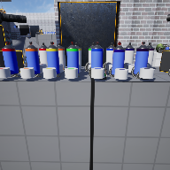

# Project Name  Mod9TestTrace

## Description

A continuation of the in class demonstration code based on UE default Virtual Reality template. Testing a spray paint material idea. 
1. gnome model, photpgrammetry, Roy S. Winter 2025:w

    
 
## Usage
Clone, or download the zip, to a local directory. Open in Unreal Engine 5.4 or newer

## Attributions

